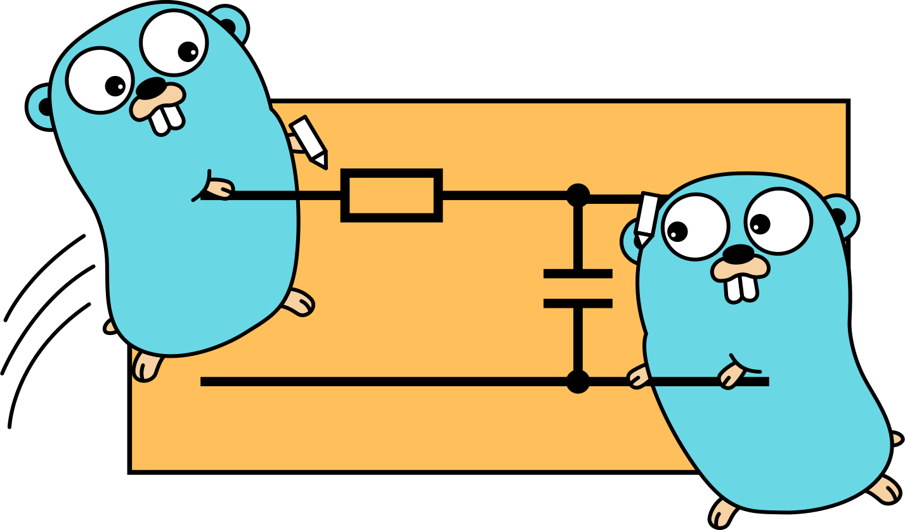
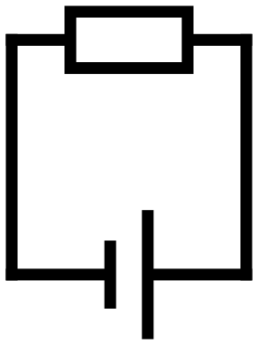

<div align="center">

<h1><code>schemgo</code></h1>
<p><em>Let the gophers put your schematic to paper!</em></p>
<a href="https://goreportcard.com/report/github.com/sermuns/schemgo"></a>
<a href="https://www.gnu.org/licenses/gpl-3.0">
</a>
</div>

> [!NOTE]
> This tool is under active development and is not currently in a usable state. Stay tuned!

## What is this?

This tool generates electrical circuit schematic diagram from code, such as [Schemdraw](https://schemdraw.readthedocs.io/en/stable/) and [circuitikz](https://github.com/circuitikz/circuitikz).

The language is very minimal and heavily inspired by Schemdraw's.

## Why choose this over Schemdraw/circuitikz?

This ships as a single binary, and is blazingly fast.

[Is easily included in `mdbook` as a preprocessor!](https://schemgo.samake.se/mdbook)

## Quickstart

```sh
go install github.com/sermuns/schemgo
```

[Many other installation methods are supported!](https://schemgo.samake.se/installation)

`schemgo` is now available in the shell, provided you have `$GOPATH/bin` (`$GOBIN`) in your `PATH`.

## Example usage

Create a file `simple.schemgo` containing:

<!-- abusing linguist syntax highlighting.. this is NOT haskell -->
```haskell
battery.right
line.up
resistor.left
line.down
```

Run:

```sh
schemgo build simple.schemgo -o simple.svg
```

The circuit diagram is created as `simple.svg`:

<div align="center">
<a href="media/simple.svg"></a>
</div>

> [!NOTE]
> Only svg output is supported at the moment.

<br>
<br>
<br>
<br>
<br>
<br>
<br>

---

## Roadmap
### ✅ Done
- [x] Push and pop
- [x] Subcommands
  - [x] `build` exports svg file
  - [x] `serve` serves a development website for live-preview
- [x] Comments with `#`
- [x] mdBook preprocessor

### 🎯 High priority
- [ ] Add labels
  - [ ] `typst` math
  - [ ] figure out ergonomic syntax.
- [ ] multiple terminal: named anchors on components?

### Normal priority
- [ ] Components (I won't attempt before situation with polymorphsim is under control.)
  - [ ] Optional style string on tags
  - [ ] (Better way of defining appearances... maybe external files?)
  - [ ] More components
    - [x] Battery
    - [x] Resistor
    - [x] Inductors
    - [x] Capacitor
    - [x] Node (dot)
    - [ ] Voltage source
    - [ ] Current source
    - [ ] Diodes
    - [ ] Transistors
    - [ ] Amperemeter
    - [ ] Voltmeter
    - [ ] Switch
    - [ ] GND (and 5V)?
- [ ] `@set` statement to change global defaults (stroke width, padding, color)
- [ ] set standard (IEC, IEEE) on elemnt, using `set`
- [ ] Element attributes
  - [ ] ID for symbolic reference
- [ ] Exporting to pdf, png, jpg, webp
- [ ] Syntax highlighting, LSP
- [ ] Logic gates
